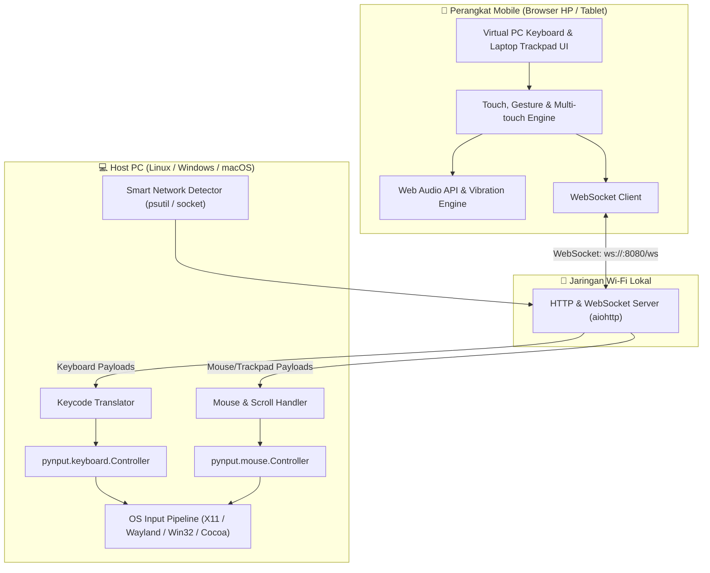

# 📐 System Architecture & Technical Specification / Arsitektur Sistem & Spesifikasi Teknis

*Read in: [Bahasa Indonesia](#-arsitektur-sistem-bahasa-indonesia) | [English](#-system-architecture-english)*

---

## 🇮🇩 Arsitektur Sistem (Bahasa Indonesia)

Dokumen ini menjelaskan desain arsitektur internal, alur data, protokol komunikasi, dan spesifikasi teknis dari **DigiKeyboard**.

### 1. Diagram Alur Arsitektur



### 2. Alur Kerja Komunikasi & Subsistem

1. **Inisialisasi Server & Jaringan Cerdas:**
   - Server menjalankan `server.py` menggunakan framework asinkron `aiohttp`.
   - Modul `get_local_ip_addresses()` secara cerdas memindai antarmuka jaringan fisik (Wi-Fi/LAN `192.168.x.x` atau `10.x.x.x`) dan memfilter interface virtual/VPN (seperti Cloudflare WARP, Docker, virbr).
   - Menghasilkan QR Code terminal dan URL HTTP untuk koneksi instan.
2. **Koneksi Klien (HP/Tablet):**
   - Browser mobile memuat antarmuka web responsif dari route `/` (`index.html`).
   - Klien membuka koneksi WebSocket persisten dua arah ke `/ws` dengan monitor ping/pong real-time (latensi 1-5 ms).
3. **Penanganan Multi-Touch & Gesture Trackpad:**
   - Komponen sentuh dioptimalkan dengan `touch-action: none` dan `preventDefault()` untuk mencegah zoom ganda, scroll bawaan browser, atau kemunculan keyboard virtual Android/iOS (Gboard dsb).
   - **Keyboard Multi-Touch & Sticky Latch:** Mendukung penekanan kombinasi multi-jari simultan, serta mode Latch untuk mengunci modifier satu per satu.
   - **Trackpad Gestures:**
     - 1 Jari: Menggerakkan kursor mouse PC secara kinetik (throttled ~120fps).
     - 1-Finger Tap: Mengirim klik kiri instan (`mouseclick: left`).
     - 2-Finger Tap: Mengirim klik kanan instan (`mouseclick: right`).
     - 2-Finger Vertical Swipe: Mengirim perintah scroll mousewheel PC (`mousescroll`).
     - Dedicated Buttons: Tombol fisik klik kiri & kanan laptop deck dengan status visual `.active`.
4. **Engine Umpan Balik Taktil (Haptic & Web Audio API):**
   - **Haptic:** `navigator.vibrate` untuk motor getar ponsel cerdas (preset: 15ms, 30ms, 50ms).
   - **Mechanical Click Synthesizer:** Dua osilator Web Audio API (`triangle` 1500Hz→350Hz untuk ketajaman speaker kecil HP + `sine` 300Hz→90Hz untuk resonansi bodi di tablet/laptop).
   - **Audio Context Unlocker:** Memastikan `audioCtx` langsung aktif (*resumed*) pada sentuhan layar pertama pengguna, melewati limitasi autoplay browser seluler.
   - **Volume Controller:** Mengatur gain audio secara presisi (10% s/d 100%) dengan isolasi memori lokal (`localStorage`).

### 3. Spesifikasi Protokol WebSocket

#### Payload Format (Client ke Server):

1. **Keyboard Events:**
```json
// Penekanan tombol normal (dengan auto-repeat):
{
  "type": "keypress",
  "key": "a" | "enter" | "backspace" | null,
  "char": "a" | "A" | null,
  "modifiers": { "ctrl": false, "alt": false, "shift": false, "cmd": false }
}

// Penekanan & pelepasan modifier / manual:
{ "type": "keydown", "key": "ctrl" }
{ "type": "keyup", "key": "ctrl" }

// Shortcut / kombinasi simultan (1-tap):
{ "type": "combo", "keys": ["ctrl", "c"] }
```

2. **Trackpad & Mouse Events:**
```json
// Gerakan kursor:
{ "type": "mousemove", "dx": 12.5, "dy": -4.2 }

// Klik tombol:
{ "type": "mouseclick", "button": "left" | "right" }
{ "type": "mousedown", "button": "left" | "right" }
{ "type": "mouseup", "button": "left" | "right" }

// Menggulir (Scroll):
{ "type": "mousescroll", "dx": 0, "dy": -3 }
```

3. **Keepalive (Ping / Pong):**
```json
// Client:
{ "type": "ping" }

// Server Response:
{ "type": "pong" }
```

---

## 🇬🇧 System Architecture (English)

This document outlines the internal architectural design, data pipelines, communication protocols, and technical specifications of **DigiKeyboard**.

### 1. High-Level Architecture Overview
The application consists of two decoupled components communicating over a local high-speed WebSocket channel:
- **Client (Frontend):** Zero-dependency single-page HTML5/CSS3/ES6 web client with raw multi-touch event listeners. It simulates a true full-sized mechanical PC keyboard without triggering native mobile on-screen keyboards.
- **Server (Backend):** Asynchronous Python server powered by `aiohttp` and `pynput`. It handles HTTP static serving, WebSocket message dispatching, smart interface filtering, and native OS keyboard event injection.

### 2. Smart Network Detection Logic
On machines running virtual interfaces (Docker, Libvirt/KVM) or VPNs (Cloudflare WARP, Tailscale, WireGuard), standard socket routing may bind to an inaccessible virtual IP. DigiKeyboard employs a tiered discovery algorithm:
1. Inspects all physical network interfaces using `psutil.net_if_addrs()`.
2. Prioritizes non-virtual interfaces within private class subnets (`192.168.0.0/16`, `10.0.0.0/8`).
3. Explicitly discards virtual prefixes (`docker*`, `br-*`, `virbr*`, `warp*`, `tun*`, `tap*`).
4. Generates terminal QR code bound directly to the reachable LAN interface.

### 3. Sticky / Latch Modifier Mechanics
Typing complex desktop shortcuts on a touch screen can be challenging with single-hand usage. DigiKeyboard implements a stateful modifier latch:
```
[User Taps "Ctrl"] ──> Modifier State: LATCHED (Visual Highlight On)
[User Taps "V"]    ──> Sends Ctrl+V ──> Automatically RELEASES "Ctrl"
```
Users can toggle between *Latch Mode* and *Raw Multi-touch Mode* directly from the header toolbar.
