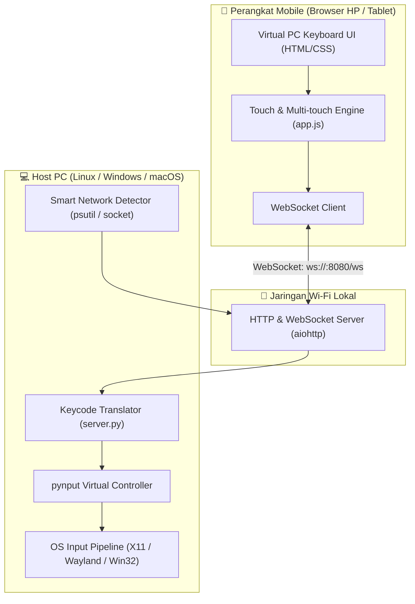

# 📐 System Architecture & Technical Specification / Arsitektur Sistem & Spesifikasi Teknis

*Read in: [Bahasa Indonesia](#-arsitektur-sistem-bahasa-indonesia) | [English](#-system-architecture-english)*

---

## 🇮🇩 Arsitektur Sistem (Bahasa Indonesia)

Dokumen ini menjelaskan desain arsitektur internal, alur data, protokol komunikasi, dan spesifikasi teknis dari **DigiKeyboard**.

### 1. Diagram Alur Arsitektur



### 2. Alur Kerja Komunikasi (End-to-End Flow)
1. **Inisialisasi Server:**
   - Server menjalankan `server.py` menggunakan framework asinkron `aiohttp`.
   - Modul `get_local_ip_addresses()` secara cerdas memindai antarmuka jaringan fisik (Wi-Fi/LAN `192.168.x.x` atau `10.x.x.x`) dan memfilter interface virtual/VPN (seperti Cloudflare WARP, Docker, virbr).
   - Menghasilkan QR Code terminal dan URL HTTP untuk koneksi instan.
2. **Koneksi Klien (HP/Tablet):**
   - Browser mobile memuat antarmuka web responsif dari route `/` (`index.html`).
   - Klien membuka koneksi WebSocket persisten dua arah ke `/ws`.
3. **Penanganan Sentuhan & Multi-Touch:**
   - Komponen sentuh dioptimalkan dengan `touch-action: none` dan `preventDefault()` untuk mencegah zoom ganda, scroll bawaan browser, atau kemunculan keyboard virtual Android/iOS (Gboard dsb).
   - Mendukung penekanan kombinasi multi-jari simultan (contoh: menahan `Ctrl` dengan jempol kiri dan menekan `C` dengan jempol kanan).
   - **Mode Sticky / Latch Modifier:** Mengetuk `Ctrl`, `Alt`, atau `Shift` satu kali akan mengunci status tombol tersebut hingga karakter berikutnya ditekan, lalu melepasnya secara otomatis.
4. **Eksekusi Input pada PC:**
   - Paket JSON dikirim melalui WebSocket ke server.
   - Server menerjemahkan string kode tombol ke objek `pynput.keyboard.Key` atau karakter literal.
   - Pynput menyuntikkan keystroke ke display server OS (X11/Win32/macOS).

### 3. Spesifikasi Protokol WebSocket

#### Payload Format (Client ke Server):
```json
{
  "type": "down" | "up" | "tap",
  "key": "a" | "enter" | "ctrl" | "f5" | "backspace",
  "modifiers": ["ctrl", "shift"]
}
```

* **`type`**:
  * `"down"`: Tombol fisik virtual mulai ditekan.
  * `"up"`: Tombol fisik virtual dilepas.
  * `"tap"`: Penekanan instan (otomatis down diikuti up, ideal untuk tombol shortcut/macro).
* **`key`**: Pengenal tombol yang cocok dengan kamus `KEY_MAPPINGS` di server.
* **`modifiers`**: Daftar tombol pengubah yang sedang aktif saat event dikirim.

---

## 🇬🇧 System Architecture (English)

This document outlines the internal architectural design, data pipelines, communication protocols, and technical specifications of **DigiKeyboard**.

### 1. High-Level Architecture Overview
The application consists of two decoupled components communicating over a local high-speed WebSocket channel:
- **Client (Frontend):** Zero-dependency single-page HTML5/CSS3/ES6 web client with raw multi-touch event listeners. It simulates a true full-sized mechanical PC keyboard without triggering native mobile on-screen keyboards.
- **Server (Backend):** Asynchronous Python server powered by `aiohttp` and `pynput`. It handles HTTP static serving, WebSocket message dispatching, smart interface filtering, and native OS keyboard event injection.

### 2. Smart Network Detection Logic
On machines running virtual interfaces (Docker, Libvirt/KVM) or VPNs (Cloudflare WARP, Tailscale, WireGuard), standard socket routing may bind to an inaccessible virtual IP. DigiKeyboard employs a tiered discovery algorithm:
1. Inspects all physical network interfaces using `psutil.net_if_addrs()`.
2. Prioritizes non-virtual interfaces within private class subnets (`192.168.0.0/16`, `10.0.0.0/8`).
3. Explicitly discards virtual prefixes (`docker*`, `br-*`, `virbr*`, `warp*`, `tun*`, `tap*`).
4. Generates terminal QR code bound directly to the reachable LAN interface.

### 3. Sticky / Latch Modifier Mechanics
Typing complex desktop shortcuts on a touch screen can be challenging with single-hand usage. DigiKeyboard implements a stateful modifier latch:
```
[User Taps "Ctrl"] ──> Modifier State: LATCHED (Visual Highlight On)
[User Taps "V"]    ──> Sends Ctrl+V ──> Automatically RELEASES "Ctrl"
```
Users can toggle between *Latch Mode* and *Raw Multi-touch Mode* directly from the header toolbar.
